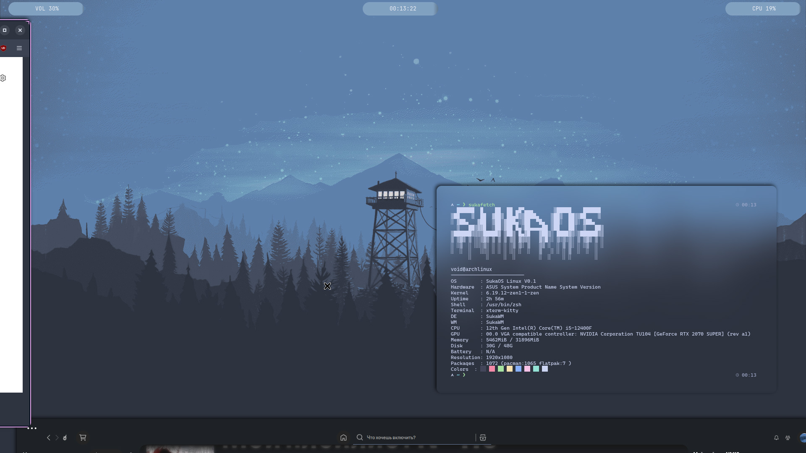

# sukawm-rice
yea its a nord themed rice for SukaWM

# Works only on:
  *  Arch
  *  Artix
  *  Void


More distros will work in the future


–––––––––––––––––––––––––––––––––––––––––––––––––––––––––––


installation does NOT need SukaWM to already be installed.

preview:
   


how to install:
```
cd ~
git clone https://github.com/tndevreal/sukawm-rice
cd sukawm-rice
sudo chown -R "$USER:$USER" * || doas chown -R "$USER:$USER" *
sudo chmod a+x install.sh || doas chmod a+x install.sh
sudo chmod a+x polybar/launch.sh || doas chmod a+x polybar/launch.sh
./install.sh
```

